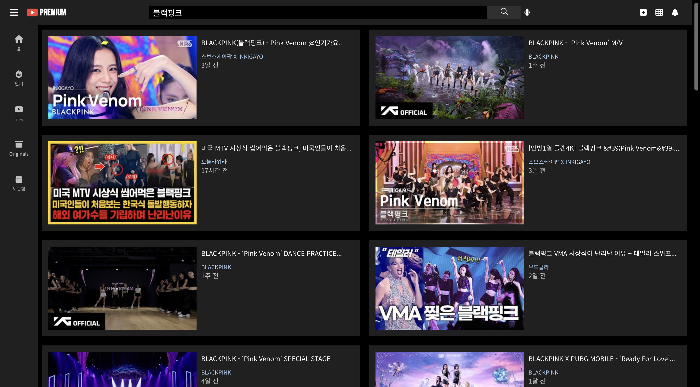

# 💻Project

SeSAC 산업진흥원 프론트엔드 실무 교육과정에서 **REACT를 기반으로 한 YOUTUBE**의 인기 동영상 목록, 동영상 상세 정보, 검색기능을 구현하였습니다.

# 🪜Architecture
src  
 ┣ components  
 ┃ ┣ Header  
 ┃ ┃ ┣ SearchForm  
 ┃ ┃ ┃ ┣ index.css  
 ┃ ┃ ┃ ┗ index.js  
 ┃ ┃ ┣ index.css  
 ┃ ┃ ┗ index.js  
 ┃ ┣ SideMenu  
 ┃ ┃ ┣ index.css  
 ┃ ┃ ┗ index.js  
 ┃ ┣ VideoItem  
 ┃ ┃ ┣ index.css  
 ┃ ┃ ┗ index.js  
 ┃ ┣ VideoList  
 ┃ ┃ ┣ index.css  
 ┃ ┃ ┗ index.js  
 ┃ ┗ VideoView  
 ┃ ┃ ┣ index.css  
 ┃ ┃ ┗ index.js  
 ┣ lib  
 ┃ ┣ api.js  
 ┃ ┗ common.js  
 ┣ pages  
 ┃ ┣ Home.js  
 ┃ ┣ Search.js  
 ┃ ┗ Watch.js  
 ┣ store  
 ┃ ┣ video  
 ┃ ┃ ┗ videoSlice.js  
 ┃ ┗ index.js  
 ┣ App.css  
 ┣ App.js  
 ┣ App.test.js  
 ┣ index.css  
 ┣ index.js  
 ┣ logo.svg  
 ┣ reportWebVitals.js  
 ┗ setupTests.js
# ⚙️Stack
REACT / REDUX-TOOLKIT / REDUX-PERSIST / REST-API
# 🔎Detail
1. 메인 페이지 구성
- useEffect()를 활용하여 처음 페이지가 렌더링 될 때 가장 인기있는 비디오 목록 리스트를 가져옵니다.
- useState()를 활용하여 Youtube Api로 부터 받아온 데이터를 저장하고 해당 데이터를 video_list, video_item 컴포넌트로 전달합니다.
2. 검색 기능 구성
- 검색 창(input)에 원하는 키워드를 입력한 후 검색을 누르면 App 컴포넌트에 있는 state가 변경되어 다시 비디오 목록을 렌더링 합니다.
3. 비디오 상세 페이지 구성
- 비디오를 클릭하게 되면 비디오 마다 가지고 있는 고유한 id를 활용하여 해당 비디오에 맞는 state로 변경합니다.
- state를 통해 상세 설명 등을 보여줍니다.

# 🚀Result
Youtube Api(video, channel)를 활용하여 가장 인기 있는 동영상의 썸네일, 채널, 제목 등을 표시

입력된  키워드를  통해 Youtube API를  사용하여  목록에  있는  동영상을  키워드에  알맞는  동영상으로  변경

선택된  비디오에  관련된  비디오  플레이어, 상세  설명, 채널  리스트  등  비디오를  클릭시 상세 페이지로 이동

# 💡Review

- useState, useEffect 등 **react hooks**를 활용하여 react의 state를 효율적으로 관리하는 방법을 알았습니다.

- **Redux-Toolkit** 활용으로 조금 더 깔끔하게 state와 dispatch를 관리할 수 있게 되었습니다.

- **REST API** 를 처음 다뤄봤는데 생각보다 가이드가 잘 되어있어서 어려움없이 적용할 수 있었으며 이미 저장된 데이터들을 불러와 다양한 컴포넌트를 구현시킬 수 있어서 신기했고 앞으로 더많은 API를 활용해야겠다고 깨달았습니다.
